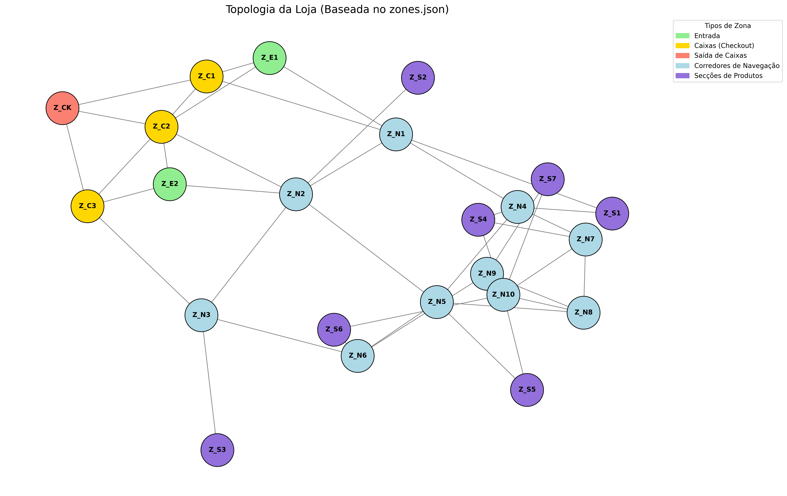

# Relatório Semanal de Performance de Retalho
**Data de Emissão:** 12/05/2026
**Modelo Analítico:** Llama 3.1:8b (Estratégia Few-Shot)

---

## Mapa de Fluxo e Topologia
A análise abaixo baseia-se na configuração física da loja. Os corredores de navegação (`Z_N`) servem como eixos centrais de tráfego, enquanto as secções de produtos (`Z_S`) funcionam como pontos de paragem.

---

## 1. Resumo Executivo (AI Generated)
- A loja registrou uma taxa de conversão de 99,1%, indicando que a maioria dos clientes está realizando compras.
- As zonas Z_S3 e Z_N5 apresentaram anomalias de afluência, com números significativamente acima da média.
- É recomendável reforçar a reposição entre as 17h e as 19h nas zonas afetadas.

---

## Saúde dos Dados e Qualidade do Sistema
*Esta secção avalia a fiabilidade das métricas apresentadas com base no ruído capturado pelos sensores.*

| Indicador de Qualidade | Valor | Estado |
| :--- | :--- | :--- |
| **Trajetórias Reconstruídas** | 10583 | OK |
| **Anomalias/Zombies Detetados** | 5849 | Ruído |
| **Taxa de Integridade do Sinal** | 64.4% | Moderada |

> **Nota Técnica:** O volume de anomalias reflete eventos de "Ping-Pong" filtrados e trajetórias fragmentadas por oclusão visual. Uma taxa acima de 60% é considerada excelente para ambientes de visão computacional em tempo real.

---

## 2. Métricas Globais de Tráfego
| Métrica | Valor |
| :--- | :--- |
| **Total de Visitantes** | 10583 |
| **Total de Compradores** | 10488 |
| **Taxa de Conversão** | 99.1% |
| **Tempo Médio de Visita** | 49.46 min |

### Afluência Diária
| Data | Visitantes |
| :--- | :--- |
| 2025-03-10 | 1746 |
| 2025-03-11 | 1570 |
| 2025-03-12 | 1859 |
| 2025-03-13 | 1928 |
| 2025-03-14 | 1903 |
| 2025-03-15 | 2392 |
| 2025-03-16 | 2178 |

---

## 3. Análise do Funil e Abandono
- **Perfil Dominante de Abandono:** F (adult)
- **Total de Potenciais Clientes Perdidos:** 95

---

## 4. Insights Estratégicos (Deep Analysis)

### Anomalia de Afluência em Z_S3
- **ID:** `INS_EX_01` | **Urgência:** ESTA_SEMANA
- **Observação:** A zona Z_S3 teve 8 visitantes, 53% acima da média.
- **Implicação:** Risco de congestionamento e rutura de stock.
- **Recomendação:** **Reforçar a reposição entre as 17h e as 19h.**
---

### Anomalia de Afluência em Z_N5
- **ID:** `INS_EX_02` | **Urgência:** ESTA_SEMANA
- **Observação:** A zona Z_N5 teve 9 visitantes, 115% acima da média.
- **Implicação:** Risco de congestionamento e rutura de stock.
- **Recomendação:** **Reforçar a reposição entre as 17h e as 19h.**
---

### Anomalia de Afluência em Z_S2
- **ID:** `INS_EX_03` | **Urgência:** ESTA_SEMANA
- **Observação:** A zona Z_S2 teve 5 visitantes, 417% acima da média.
- **Implicação:** Risco de congestionamento e rutura de stock.
- **Recomendação:** **Reforçar a reposição entre as 17h e as 19h.**
---

### Anomalia de Afluência em Z_N6
- **ID:** `INS_EX_04` | **Urgência:** ESTA_SEMANA
- **Observação:** A zona Z_N6 teve 2 visitantes, 67% abaixo da média.
- **Implicação:** Risco de queda de tráfego e perda de faturação.
- **Recomendação:** **Reforçar a promoção em redes sociais.**
---

### Anomalia de Afluência em Z_C2
- **ID:** `INS_EX_05` | **Urgência:** ESTA_SEMANA
- **Observação:** A zona Z_C2 teve 40 visitantes, 133% acima da média.
- **Implicação:** Risco de congestionamento e rutura de stock.
- **Recomendação:** **Reforçar a reposição entre as 17h e as 19h.**
---

*Relatório gerado automaticamente pelo Sistema de Monitorização de Trajetórias TP1.*